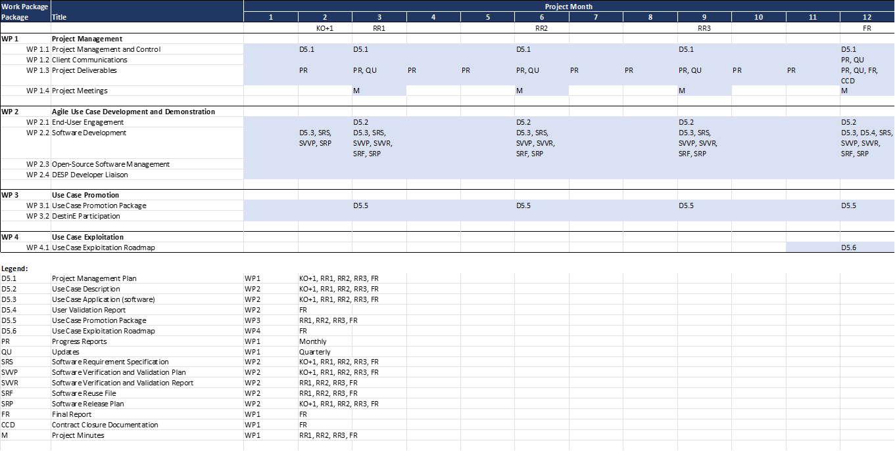

[[Schedule]]
= Schedule

== Milestones

The project started on 15 February 2023 and will proceed for 18 months.
The timing of the project milestones is shown in <<ProjectReviews>> and illustrated
in the bar chart of <<ProjectSchedule>>.

[[ProjectReviews]]
.Project Reviews
[cols="3,5,7,3,2"]
|===
| Review      | Description              | Deliverables                                      | Schedule      | Venue

|RR 1         | Focus on Polar TEP       | D5.1, D5.2, D5.3, D5.5, SRS, SVVP, SVVR, SRF, SRP | KO + 3 months | Virtual
|RR 2         | Focus on Polar Dashboard | D5.1, D5.2, D5.3, D5.5, SRS, SVVP, SVVR, SRF, SRP | KO + 6 months | Virtual
|RR 3         | Focus on IcySea          | D5.1, D5.2, D5.3, D5.5, SRS, SVVP, SVVR, SRF, SRP | KO + 9 months | Virtual
|Final Review | Focus on integration across Polar TEP, Polar Dashboard, and IcySea. Presentation of final project results. | D5.1, D5.2, D5.3, D5.4, D5.5, D5.6, SRS, SVVP, SVVR, SRF, SRP, FR, CCD | KO + 12 months | Virtual
|===

== Bar Chart
:xrefstyle: short

The project started on 10 November 2023 and will proceed for one year.
<<ProjectSchedule>> shows the project schedule, including all proposed Work
Packages, meetings, deliverables, and progress reports.

[[ProjectSchedule]]
.Project Schedule

